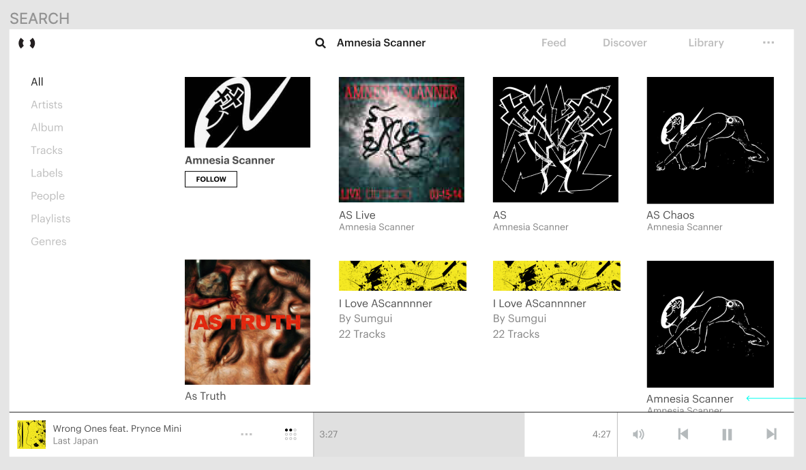

> 🛠 **Status: Maintenance Mode | Stable**
>
> This project is currently in [maintenance mode](https://en.wikipedia.org/wiki/Maintenance_mode) - users should feel free to continue to use this app and expect bug fixes, but not expect many additional features.

# Resonate Search Demo

## Stack

- Mongodb with mongoose and mongoosastic
- Elasticsearch
- Koajs

## Models

- Track
- Profile
- Release

## Sync data

To save/update data into elasticsearch, the following script needs to be ran

```sh
babel-node -r ./node_modules/dotenv-safe/config ./src/scripts/migrate run
```

It's configured to connect to our wordpress db which also have a table for tracks.

## Query

With no minimum query length, fuzzy query is possible. The results will be merged and sorted by score.

Use the 'kind' field to identify the model (track|artist|label|band)

```json
[
  {
    "kind": "track",
    "title": "capitalism crashed",
    "display_artist": "AGF",
    "album": "capitalism crashed",
    "tags": ["experimental"]
  }
]
```

## Flow

```flow
st=>start: Search API
e=>end: Return error
query=>operation: Query
cond=>condition: Invalid query?
io=>inputoutput: catch error...
para=>parallel: Search tracks and profiles
response=>end: Return merged results sorted by score

st->query->cond
cond(no)->para
cond(yes)->io->e
para(path1, bottom)->response(right)
para(path2, top)
```

## UI Design


